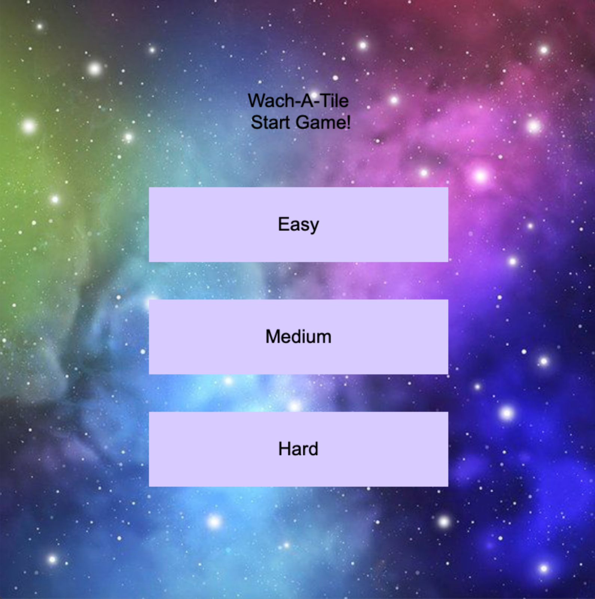
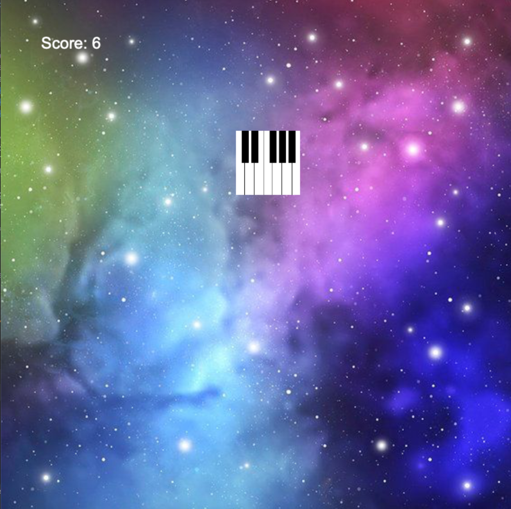
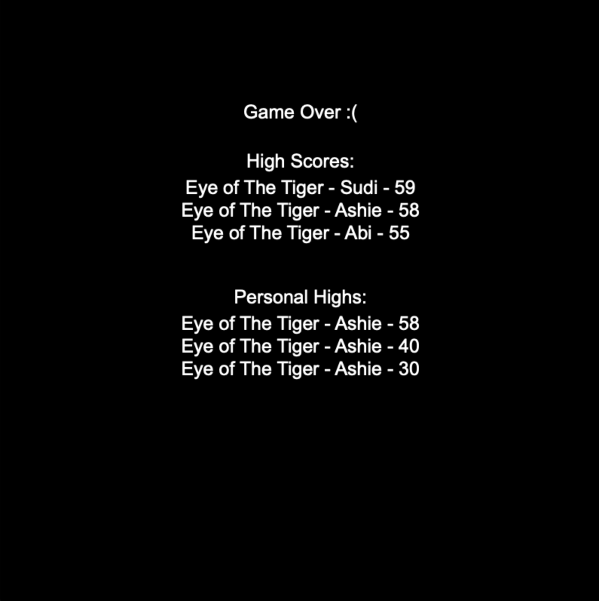

# Final Project

## Wach-A-Tile
#### Author: [Ashwini Sarvepalli]

### **What is this Project/How to Play the Game?**
Wach-A-Tile is a CMake project using cinder and other external libraries.
Players can choose between three different songs of differing bpm levels, slow to fast. 
In accordance to the beat, tiles will pop up on screen for players to click to gain points. 
The game finishes if users click on a spot where there isn't a tile, or until the whole song is finished. 
When the game is over a leaderboard is later displayed of the high scores of for the specific song and the the personal 
players high scores
To restart the game at any point and take you back to the home screen, just alt/option click.

#### **Game Screens**
The following pictures show the 3 different screens possible for this app. The Home Screen, The Game Play Screen, and \
the Game Over Screen respectively

### **Building the Project**
#### **Set Up of the Project**
As this is a CMake Project, so in order to run one should have Cmake installed. This project uses the following libraries
  * [link to Cinder library](https://github.com/cinder/Cinder)
  * This is a basic tutorial to develop Cinder projects: [Cinder Projects Tutorial](https://libcinder.org/docs/guides/tour/hello_cinder_chapter1.html)

This project also uses the following external libraries
  * [link to SQliteModernCpp library](https://github.com/SqliteModernCpp/sqlite_modern_cpp/tree/dev)
  * [link to gflags library](https://github.com/gflags/gflags)

Once the cinder framework is downloaded Users will have to add these external libraries to the apps/CMakeLists.txt in apps as well as 
the src/CMakeLists.txt after FetchContent_Declare and FetchContent_GetProperties for the external libraries in theCMakeLists.txt. 
In order to create set up the database, using the SQLite external library and for inputs for player name, the tile size, and how many 
tiles would fit side by side on the screen, I used gflags.

#### **What Header and CC files**
The **mole_leaderboard** has to logic for creating the leaderboard, and inputting and retrieving the appropriate
information for game over. The **player.h** file represents the Player which has it's own attributes of name and 
score which info would be used as input for the leaderboard. The main components of the game includes the Tile, Location, 
and Engine classes. 
The **Location class** represents a pixelated location on the screen within the bounds of the size*tile_size gflag values. 
Each location has x and y values.
The **Tile class** represents the piano tiles in the game as well as the tile in the home screen as buttons for easy, medium, and hard.
Each Tile has a location, width, height, and is_clicked attribute for where the tile has been clicked or not. There is
also a function for checking if the mouse has clicked within the bounds of a tile for the game play. The is_clicked attribute
makes sure that the player does not get multiple points by clicking on a tile in the same position.
The Tile class and the Location class work in conjunction for game play logic in the **Engine class**. The Engine class represent 
a game play per round, so there is logic for moving a Tile to different random locations, and 
updating the score if the player has successfully clicked a tile. The engine also has a tile size attribute as well as length as
I decided the piano tiles would always be a square so only a length quality is required.

#### **Mole_App.cc and Mole_App.h**
These files are wear all the previous classes work together for the app to be playable. The main functions of MyApp(): initializes all of the necessary variables
setup(): where I load the song assets to be used for the game. update(): checks for game state and populates and retrieves the appropriate
information from the leaderboard for game over. Or moving the tile for playing the game. draw(): has the logic for drawing 
all the parts of the screens. Finally there is void mouseDown(): has the logic for what happens when a
player clicks the mouse.

---
**Author**: Ashwini Sarvepalli - [`ashwini6@illinois.edu`](mailto:ashwini6@illinois.edu)
